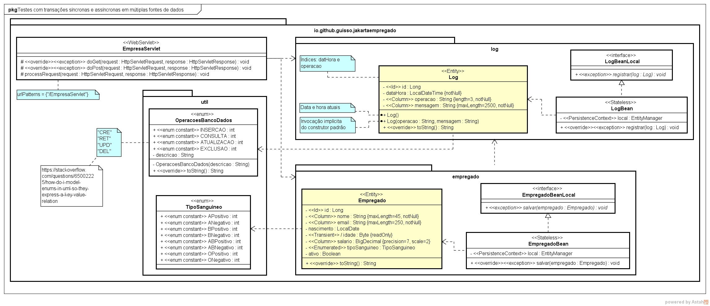

# JakartaEmpregado

A project to test EJB, JPA and data sources in Jakarta EE applications. Here we should test transactions under various circumstances: XA data sources, ACID in two persistence units, asynchronous operations and more.

Este projeto está licenciado pela [CC BY-NC-SA 4.0](https://creativecommons.org/licenses/by-nc-sa/4.0/).

